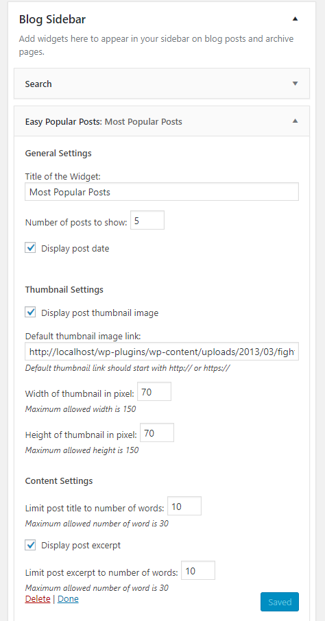
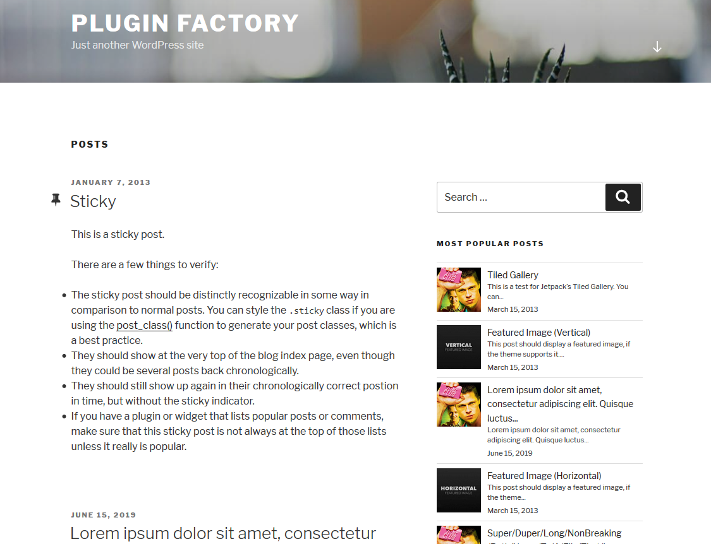

# WordPress Easy Popular Posts List Plugin
    

## Features
- No coding required = Win :sunglasses:
- Easy drag-and-drop widget
- Option to limit number of popular posts to show
- Option to show/hide post date
- Option to select default thumbnail images for post that do not have featured images
- Option to choose thumbnail width and height _(currently 150px x 150px is maximum, I don't why you'd want larger than that)_
- Option to limit post title length by number of words
- Option to show/hide post excerpt
- Option to limit post excerpt length by number of words

## How To Use
- Clone or download the repository in your plugin folder _wp-content > plugins_
- Activate the plugin from _Dashboard > Plugins > Installed Plugins_ page
- Go to _Dashboard > Appearance > Widget page_ and you'll find "Easy Popular Posts" under _Available Widgets_ list
- Add the widget to any of your Sidebars to start working
Here is a screen grab of configuring this widget

## Dependency Requirement
PHP 5.3+, because I use PHP <code>namespace</code> to avoid any unwanted collision of my functions and classes with the functions and classes of the theme or other plugins.

## Underlying Logic
Simple. Every view to a certain post is counted. The posts with the highest view counts are considered as the most popular posts.

## Style and Appearance
The styling will vary based on your theme and your custom CSS. But here is a screen grab using Twenty Seventeen theme.

## Unit Test
I've tested this plugin with the unit test data from [WP Test](http://wptest.io).

## Future Plans
This plugin was a one-sitting code project during a weekend night. Obviously it can have a lot of improvements. Here is my personal checklist:
- [ ] Adding option for limiting posts based on categories
- [ ] Adding option for limiting posts based on tags
- [ ] Adding a properly interactive way of uploading the default thumbnail image
- [ ] Adding options to disaply which categories and tags a post belongs to
- [ ] Adding a [shortcode] option to call the widgets from anywhere
- [ ] Adding options with two WYSWYG type editors in the widget to add content that will be displayed just before the post list and just after the post list
- [ ] Adding options to exclude current post and sticky post from the popular post list
- [ ] Adding support for custom pots types
- [ ] Adding option for limiting posts based on custom taxonomy
